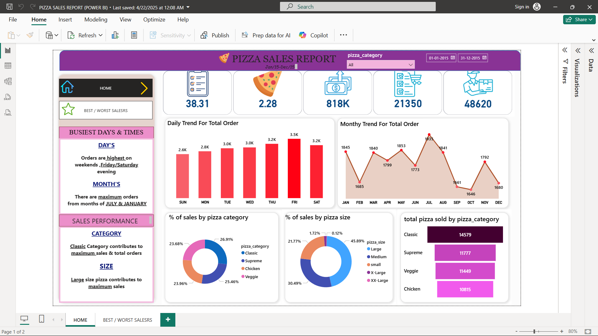
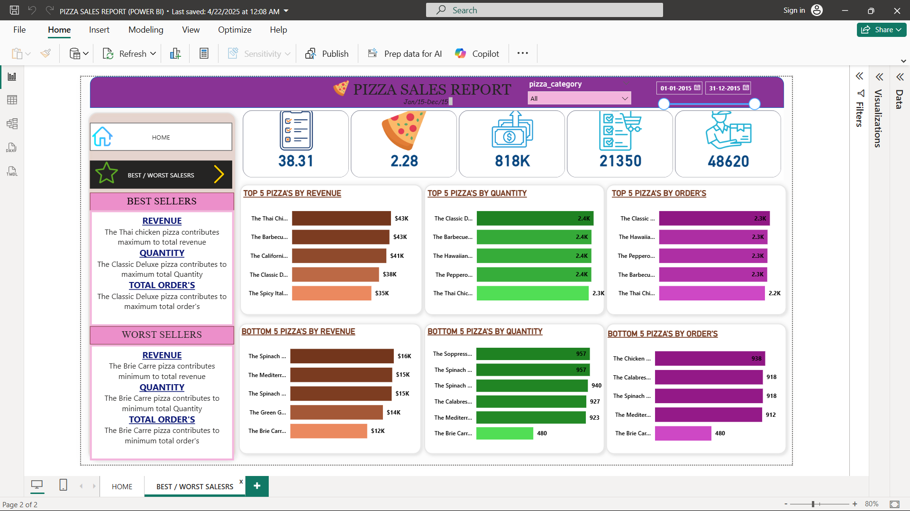

# 🍕 Pizza Sales Dashboard – Power BI

## 📌 Project Description
An interactive Power BI dashboard analyzing pizza sales data to uncover key business insights such as revenue trends, best-selling pizzas, customer ordering patterns, and category-wise performance.

---

## 📊 Dashboard Overview
This dashboard provides insights into:
- Total Revenue
- Total Orders
- Total Pizzas Sold
- Average Order Value
- Daily & Monthly Order Trends
- Sales by Pizza Category & Size
- Top & Bottom Performing Pizzas

---

## 🖼️ Dashboard Screenshots

### 🔹 Overall Dashboard


### 🔹 Sales by Category


---

## 🛠️ Tools & Technologies
- Power BI  
- SQL  
- Microsoft Excel / CSV  
- Data Visualization  

---

## 📂 Dataset
- Source: Pizza Sales Dataset  
- File: `pizza_sales.csv`
- Contains order details, pizza category, size, quantity, and revenue

---

## 📈 KPIs Calculated
- Total Revenue  
- Average Order Value  
- Total Orders  
- Total Pizzas Sold  
- Average Pizzas per Order  

---

## 🧮 SQL Analysis
SQL queries were used to calculate KPIs and trends such as:
- Daily & Monthly order trends
- Sales percentage by category & size
- Top & Bottom pizzas by revenue, quantity, and orders

All SQL queries are available in:
```
SQL/pizza_sales_sql_queries.sql
```

---

## 🚀 Key Insights
- Classic pizzas contribute the highest revenue
- Large-sized pizzas dominate total sales
- Weekends generate more orders than weekdays
- A small set of pizzas drive majority of revenue

---

## 👨‍💻 Author
**Pratik Siramwar**  
AIML | Data Analytics | Power BI  
IIIT Nagpur


